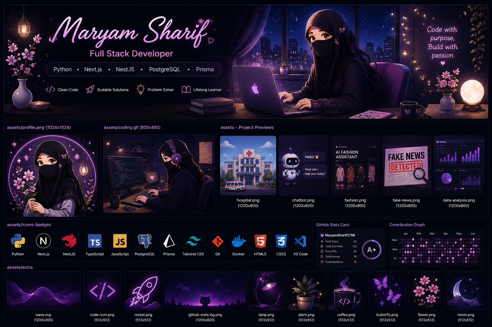
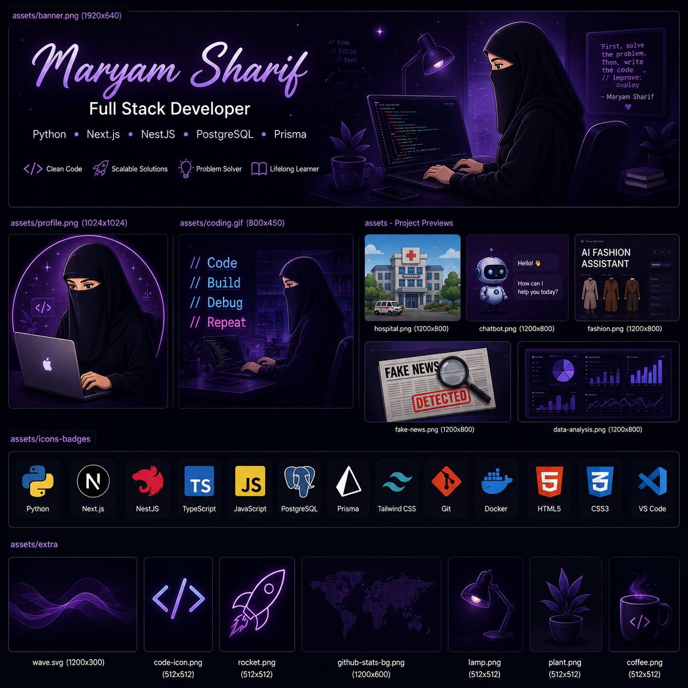

# 👋 Hi, I'm Maryam Sharif

### Full Stack Developer • Python Developer • Building Scalable Web Applications

---

# 💫 About Me

I'm a **BS Data Science student** and an aspiring **Full Stack Developer** passionate about building modern, scalable, and user-friendly applications.

I enjoy transforming ideas into real-world software using modern technologies and continuously improving my backend and frontend development skills.

### Highlights

- 💻 Full Stack Web Development
- 🐍 Python Development
- ⚡ Backend API Development
- 🌐 Modern Web Applications
- 🚀 Building Real-World Projects
- 📍 Lahore, Pakistan

---

# 🛠 Tech Stack

### Languages

### Frontend

### Backend

### Database

### Tools

---

# 🚀 Featured Projects

### 🏥 AI Powered Hospital Management System
Modern healthcare platform with AI-powered features for efficient hospital management.

### 🤖 AI Medical Chatbot
Conversational AI assistant capable of answering healthcare-related queries.

### 👗 AI Fashion Assistant
AI recommendation system for personalized fashion suggestions.

### 💊 AI Medicine Recommendation System
Machine learning based medicine recommendation application.

### 📰 Fake News Detection
Deep learning project for detecting misinformation.

### 🚜 Animal Herd Detection
Computer Vision solution for livestock monitoring.

### 🛠 REST API Projects
Secure backend APIs built using NestJS and PostgreSQL.

---

# 📊 GitHub Analytics

---

# 🌱 Currently Exploring

- Python
- Next.js
- NestJS
- Django
- Docker
- PostgreSQL
- REST APIs
- System Design
- Authentication & Authorization
- Deployment

---

# 🤝 Let's Connect

<!-- Add LinkedIn -->
<!-- Add Portfolio -->

---

### 💜 Thanks for visiting my profile!

⭐ If you like my work, consider giving a star to my repositories.

