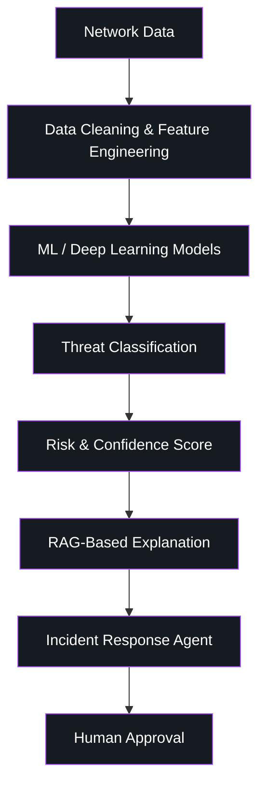

 

&nbsp;

&nbsp;

  

<a href="#about">About</a> &nbsp;•&nbsp;
<a href="#education">Education</a> &nbsp;•&nbsp;
<a href="#projects">Projects</a> &nbsp;•&nbsp;
<a href="#skills">Tech Stack</a> &nbsp;•&nbsp;
<a href="#focus">Focus</a> &nbsp;•&nbsp;
<a href="#stats">Analytics</a> &nbsp;•&nbsp;
<a href="#connect">Connect</a>

## 👩‍💻 About Me

I'm a **BS Data Science student and developer** interested in building practical software solutions, backend systems, data-driven applications, and machine learning projects.

| | |
| :-- | :-- |
| 🎓 **Education** | BS Data Science |
| 📍 **Location** | Lahore, Pakistan |
| 💡 **Interests** | Data Science, Python, Backend, Full Stack, Machine Learning, Cybersecurity, Data Engineering |
| 🛠️ **Tech Stack** | Python, SQL, JavaScript, TypeScript, FastAPI, Flask, Django, NestJS, Next.js, PostgreSQL, Prisma, Scikit-Learn, TensorFlow |
| 🔨 **Building** | AI-powered applications, Backend systems, AI-based cybersecurity tools |
| 🌱 **Learning** | Data Engineering, ETL Pipelines, Docker, Cloud & Deployment |
| 💬 **Motto** | *Learn. Build. Improve.* |

## 🎓 Education

|     🎓 Degree    |   📚 Field   |    🏫 Institution   |
| :--------------: | :----------: | :-----------------: |
|      **BS**      | Data Science | Superior University |
| **Intermediate** |  Pre-Medical |    Punjab College   |

## 🚀 Featured Projects

### 🛡️ Multi-Layer AI Scam & Fraud Detection System

> A multi-layer fraud detection system combining **voice, conversation, and message-level analysis** to identify different forms of scams and phishing attacks.

**Modules**

* 🎙️ Deepfake / spoofed voice detection
* 💬 Scam conversation detection
* 📱 SMS phishing & spam detection
* 🔍 Multi-layer risk analysis
* 📊 Machine learning & deep learning models

**Datasets:** `ASVspoof 2019 LA` · `In-The-Wild` · `Common Voice Urdu` · `Scammer Conversations` · `SMS Phishing`

### 🎙️ VoxOps — Voice Operating Layer for Organizations

> Backend system for an organization-focused voice operating layer with authentication, authorization, organizations, invitations, and knowledge-base management.

**Key Features**

* 🔐 JWT Authentication
* 👥 Role-Based Access Control
* 🏢 Organization Management
* 📩 Member Invitations
* 📚 Knowledge-Base Management
* 🔄 Knowledge Lifecycle: Draft → Pending → Authorized → Archived
* 📧 Verification & Password Reset
* 🧪 CI-Integrated Backend

### 🏥 AI Powered Hospital Management System

> Full-stack healthcare management platform combining modern web technologies, secure authentication, database management, and AI-powered assistance.

**Key Features**

* 🔐 JWT Authentication & Authorization
* 👥 Role-Based Access
* 📅 Appointment Management
* 🏥 Patient Management
* 🤖 AI Chatbot
* 🗄️ PostgreSQL Database
* 🔌 REST APIs

### 🛡️ CyberGuard — Cyber Threat Intelligence & Automated Incident Response

> A cybersecurity intelligence platform designed to detect malicious network activity, classify threats, explain predictions, and support automated incident-response workflows.

**Architecture**

```mermaid
flowchart TD
    A["Network Data"] --> B["Data Cleaning & Feature Engineering"]
    B --> C["ML / Deep Learning Models"]
    C --> D["Threat Classification"]
    D --> E["Risk & Confidence Score"]
    E --> F["RAG-Based Explanation"]
    F --> G["Incident Response Agent"]
    G --> H["Human Approval"]
    classDef n fill:#161b22,stroke:#a855f7,color:#ffffff
    class A,B,C,D,E,F,G,H n
```

**Dataset:** `UNSW-NB15`

### 🤖 AI Medical Chatbot

> Conversational healthcare assistant developed using Python, Flask, LangChain, and an LLM-based architecture.

### 📰 Fake News Detection

> Machine learning and deep learning project for identifying potentially misleading news content using NLP techniques.

### 💊 AI Medicine Recommendation System

> Machine learning based recommendation system using user symptoms.

## 🧠 Tech Stack

### 💻 Programming

### 📊 Data Science

### ⚙️ Backend

### 🎨 Frontend

### 🗄️ Databases

### 🛠️ Tools

## 🌱 Current Focus

| 🔹 Area                 | 🔹 Focus                    |
| :---------------------- | :-------------------------- |
| 🛡️ **Cybersecurity**   | AI-powered threat detection |
| 🧠 **Machine Learning** | ML & Deep Learning          |
| ⚙️ **Backend**          | APIs & scalable services    |
| 🔄 **Data Engineering** | ETL & data pipelines        |
| 🗄️ **Databases**       | PostgreSQL & data systems   |
| 🐳 **DevOps**           | Docker & deployment         |
| ☁️ **Cloud**            | Cloud technologies          |
| 🏗️ **Architecture**    | Scalable system design      |

## 📊 GitHub Analytics

  

  

## 🤝 Let's Connect

&nbsp;

  

### ⭐ Thanks for visiting!

**Learn → Build → Ship → Improve**

<a href="#top">⬆ Back to top</a>

