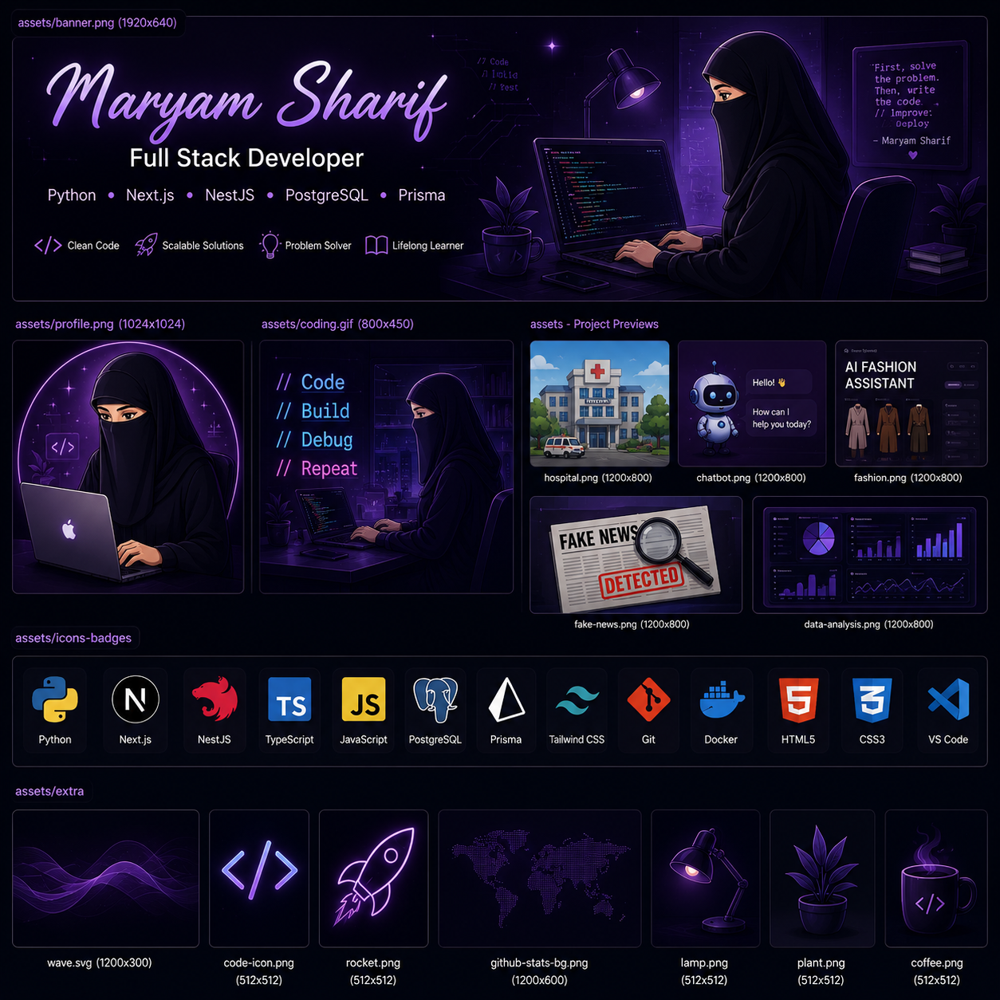

<div align="center">


<br>

<a href="https://github.com/maryam441">

</a>

<a href="mailto:maryam49206@gmail.com">

</a>

<br><br>


</div>

---

# 👩‍💻 About Me



```python
class MaryamSharif:

    role = "Data Science Student & Developer"
    location = "Lahore, Pakistan"

    education = "BS Data Science"

    interests = [
        "Data Science",
        "Python Development",
        "Backend Development",
        "Full Stack Development",
        "Machine Learning",
        "Data Engineering"
    ]

    technologies = [
        "Python",
        "SQL",
        "FastAPI",
        "Flask",
        "Django",
        "NestJS",
        "Next.js",
        "PostgreSQL"
    ]

    currently_building = [
        "AI-powered applications",
        "Backend systems",
        "Data-driven solutions",
        "Machine learning projects"
    ]

    currently_learning = [
        "Data Engineering",
        "ETL Pipelines",
        "Docker",
        "Cloud & Deployment"
    ]

    motto = "Learn. Build. Improve."
```

---

# 🎓 Education

| Degree           | Field        | Institution         |
| ---------------- | ------------ | ------------------- |
| **BS**           | Data Science | Superior University |
| **Intermediate** | Pre-Medical  | Punjab College      |

---

# 🚀 Featured Projects

### 🛡️ Multi-Layer AI Scam & Fraud Detection System

A multi-layer fraud detection system combining **voice, conversation, and message-level analysis** to identify different forms of scams and phishing attacks.

**Modules**

* 🎙️ Deepfake / spoofed voice detection
* 💬 Scam conversation detection
* 📱 SMS phishing & spam detection
* 🔍 Multi-layer risk analysis
* 📊 Machine learning & deep learning models

**Datasets**

`ASVspoof 2019 LA` · `In-The-Wild` · `Common Voice Urdu` · `Scammer Conversations` · `SMS Phishing`

**Tech:** `Python` · `TensorFlow` · `Scikit-Learn` · `NLP` · `Deep Learning`

---

### 🎙️ VoxOps — Voice Operating Layer for Organizations

Backend system for an organization-focused voice operating layer with authentication, authorization, organizations, invitations, and knowledge-base management.

**Key Features**

* 🔐 JWT authentication
* 👥 Role-Based Access Control
* 🏢 Organization management
* 📩 Member invitations
* 📚 Knowledge-base management
* 🔄 Knowledge lifecycle: Draft → Pending → Authorized → Archived
* 📧 Verification & password reset flows
* 🧪 CI-integrated backend

**Tech:** `FastAPI` · `Python` · `Pydantic` · `JWT` · `PostgreSQL` · `Alembic`

---

### 🏥 AI Powered Hospital Management System

Full-stack healthcare management platform combining modern web technologies, secure authentication, database management, and AI-powered assistance.

**Key Features**

* 🔐 JWT authentication & authorization
* 👥 Role-based access
* 📅 Appointment management
* 🏥 Patient management
* 🤖 AI chatbot
* 🗄️ PostgreSQL database
* 🔌 REST APIs

**Tech:** `Next.js` · `NestJS` · `PostgreSQL` · `Prisma` · `JWT`

<a href="https://github.com/maryam441/AI-Powered-hospital-management-system">

</a>

---

### 🛡️ CyberGuard — Cyber Threat Intelligence & Automated Incident Response

A cybersecurity intelligence platform designed to detect malicious network activity, classify threats, explain predictions, and support automated incident-response workflows.

**Planned Architecture**

```text
Network Data
     ↓
Data Cleaning & Feature Engineering
     ↓
ML / Deep Learning Models
     ↓
Threat Classification
     ↓
Risk & Confidence Score
     ↓
RAG-based Explanation
     ↓
Incident Response Agent
     ↓
Human Approval
```

**Tech:** `Python` · `Scikit-Learn` · `XGBoost` · `1D-CNN / LSTM` · `FastAPI` · `RAG` · `Vector Database`

**Dataset:** `UNSW-NB15`

---

### 🤖 AI Medical Chatbot

Conversational healthcare assistant developed using Python, Flask, LangChain and an LLM-based architecture.

**Tech:** `Python` · `Flask` · `LangChain` · `Qwen` · `SQLite`

<a href="https://github.com/maryam441/AI_Dr-">

</a>

---

### 📰 Fake News Detection

Machine learning and deep learning project for identifying potentially misleading news content using NLP techniques.

**Tech:** `Python` · `TensorFlow` · `NLP` · `1D-CNN` · `LSTM`

---

### 💊 AI Medicine Recommendation System

Machine learning based recommendation system using user symptoms.

**Tech:** `Python` · `Scikit-Learn` · `Random Forest` · `KNN`

<a href="https://github.com/maryam441/AI-project">

</a>

---

# 🧠 Tech Stack

### Programming & Data

<p>

</p>

<p>


</p>

### Backend

<p>

</p>

### Frontend

<p>

</p>

### Databases

<p>

</p>

### Tools

<p>

</p>

---

# 🌱 Current Focus

* 🛡️ AI-powered Cybersecurity
* 🧠 Machine Learning & Deep Learning
* ⚙️ Backend Engineering
* 🔄 Data Engineering & ETL
* 🗄️ PostgreSQL & Database Systems
* 🐳 Docker & Containerization
* ☁️ Cloud & Deployment
* 🏗️ Scalable System Design

---

# 📊 GitHub Analytics

<p align="center">


</p>

<p align="center">


</p>

<p align="center">


</p>

---

# 🤝 Let's Connect

<div align="center">

<a href="https://github.com/maryam441">

</a>

<a href="mailto:maryam49206@gmail.com">

</a>

</div>

<br>

<div align="center">

### ⭐ Thanks for visiting!

**Learn → Build → Ship → Improve**

</div>


